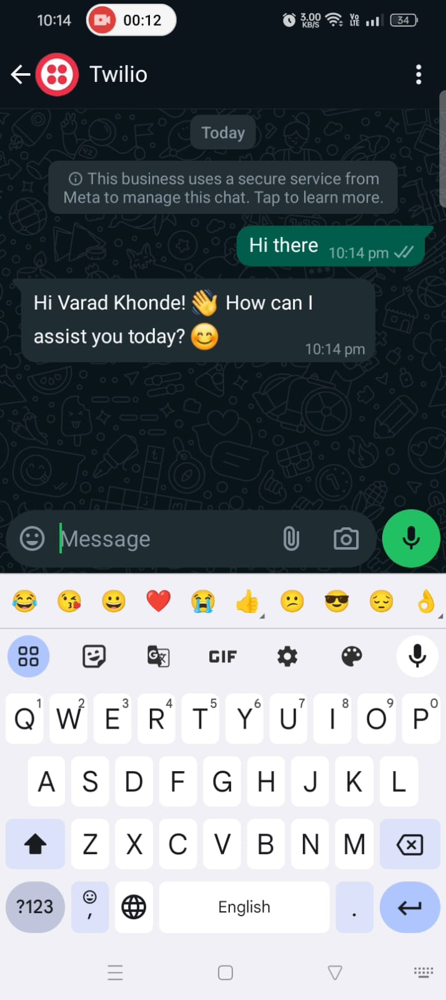
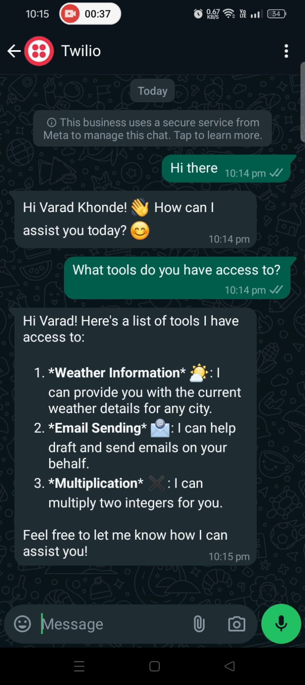
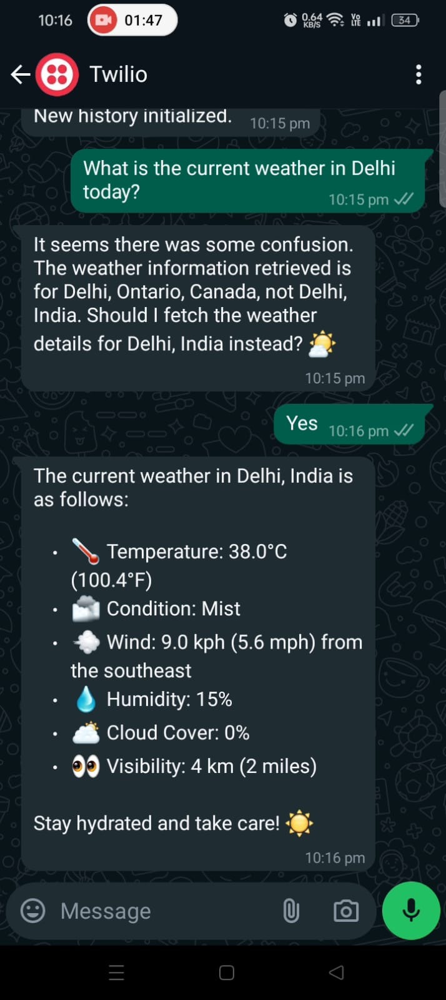
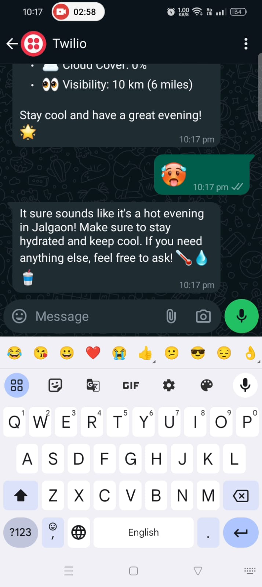
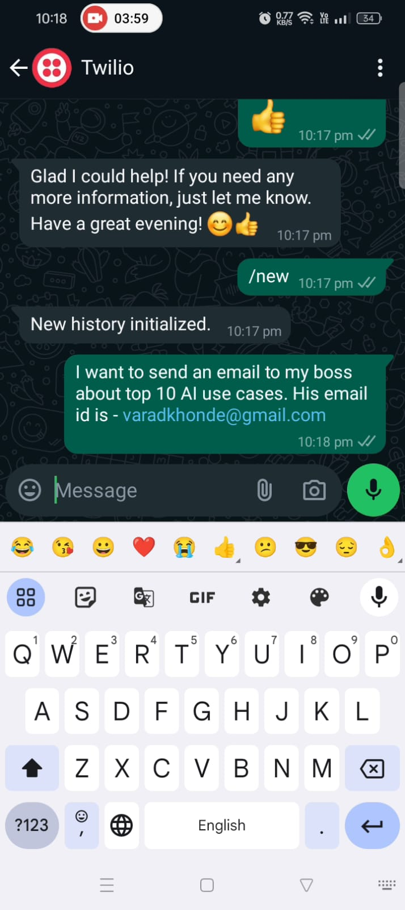
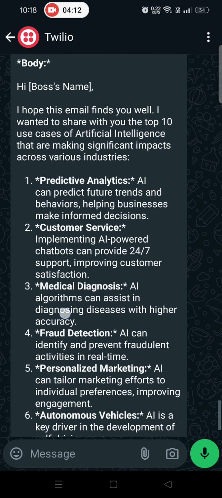
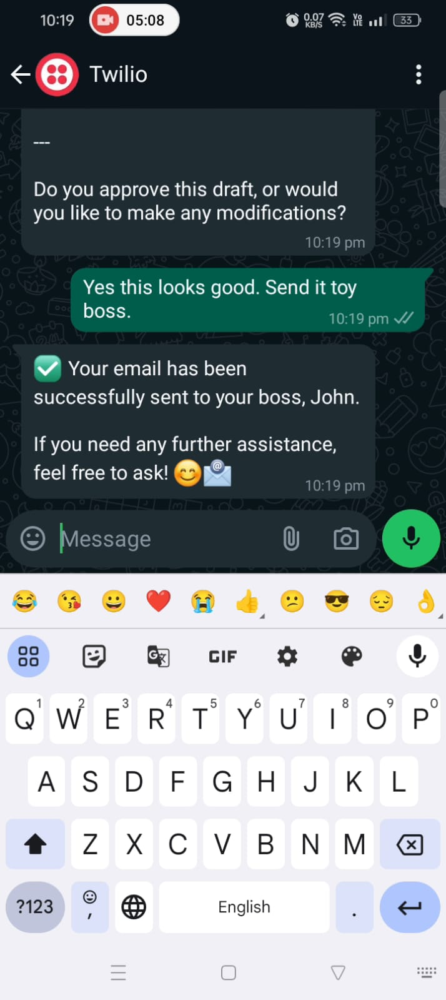
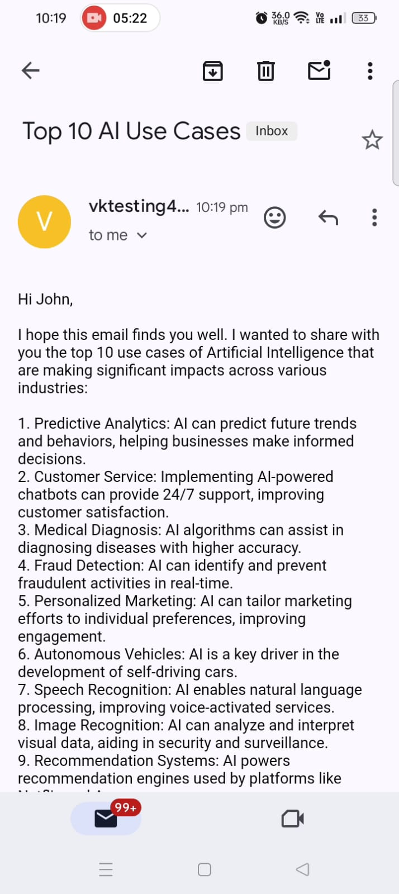

# Connecting LLMs to Whatsapp

In this project, I have tried to connect chatbots to whatsapp using TWILIO API. The chatbots have access to the user defined tools.  
THIS PROJECT IS CURRENTLY IN PROGRESS AND NOT COMPLETE. 

# DEMO
## Video
[[Watch the video]](https://drive.google.com/file/d/1E08VkCfCCUaUzEODFTfpndND2CcXzYqr/view?usp=drive_link)
## Images

  
   
  

  
  
  

  
  

## Working
- Once the user connects whatsapp number to Twilio service using a code, s/he is set to send the messages.
- The messages are routed to the above mentioned API endpoint and then LLM API is called to get the response (currently GPT-4). 
- Then the response is sent back to the user as a whatsapp message. 
- A simple database, just a dictionary, is used to store the messages corresponding to the unique phone numbers.
## API DETAILS
A flask api endpoint "/messages" is created and deployed on the Render and the corresponding API url is connected to the Twilio api(Currently in sandbox environment). 

## LLM Details
- Currently OPENAI GPT is used.

## USER DEFINED TOOLS
- Weather tool
- Send email tool
    - Email is sent via my email.
- MUTLIPLY TWO NUMBERS TOOL

